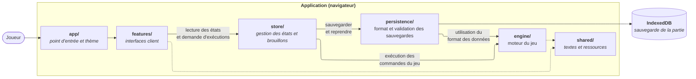

# 1. Architecture générale

Les grandes couches de l'application, de l'écran jusqu'au stockage. Le moteur ne dépend de rien : c'est le cœur, que le reste appelle.

```mermaid
---
config:
  layout: elk
  theme: default
  look: classic
---
flowchart LR
    joueur(["Joueur"])

    subgraph navigateur["`**Application (navigateur)**`"]
        app@{ label: "**app/**<br>*point d'entrée et thème*", shape: rect }
        features["`**features/**<br>*interfaces client*`"]
        store["`**store/**<br>*gestion des états et brouillons*`"]
        persistence["`**persistence/**<br>format et validation des sauvegardes`"]
        engine["`**engine/**<br>moteur du jeu`"]
        shared["`**shared/**<br>*textes et ressources*`"]
    end

    idb[("`**IndexedDB**<br>*sauvegarde de la partie*`")]

    joueur --> app
    app --> features
    features -- lecture des états<br>et demande d'exécutions --> store
    features .-> shared
    store -- exécution des<br>commandes du jeu --> engine
    store -- sauvegarder<br>et reprendre --> persistence
    persistence -- utilisation du<br>format des données --> engine
    persistence --> idb
    engine .-> shared

    app
    features
    shared
    store
    persistence
    engine
    joueur
    idb
```
