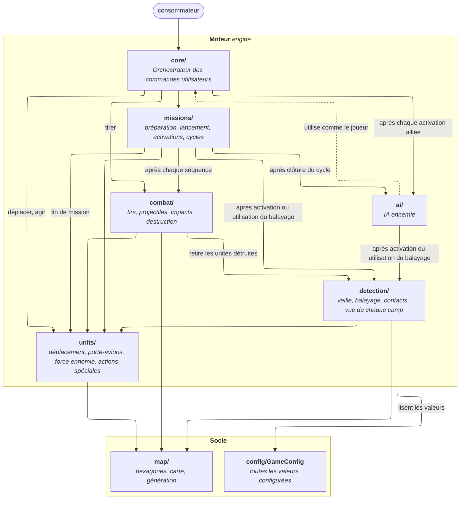

# 2. Le moteur (`src/engine/`)

Interaction générale entre les modules du moteur.

```mermaid
---
config:
  layout: elk
  look: classic
  theme: default
---
flowchart TB
 subgraph regles["`**Moteur** *engine*`"]
        core["`**core/**<br>*Orchestrateur des commandes utilisateurs*`"]
        missions["`**missions/**<br>*préparation, lancement, activations, cycles*`"]
        units["`**units/**<br>*déplacement, porte-avions, force ennemie, actions spéciales*`"]
        combat["`**combat/**<br>*tirs, projectiles, impacts, destruction*`"]
        detection["`**detection/**<br>*veille, balayage, contacts, vue de chaque camp*`"]
        ai["`**ai/**<br>*IA ennemie*`"]
  end
 subgraph socle["`**Socle**`"]
        map["`**map/**<br>*hexagones, carte, génération*`"]
        config["`**config/GameConfig**<br>*toutes les valeurs configurées*`"]
  end
    api(["consommateur"]) --> core
    core --> missions
    core -- déplacer, agir --> units
    core -- tirer --> combat
    missions -- après chaque séquence --> combat
    missions -- fin de mission --> units
    core -- après chaque activation alliée --> ai
    missions -- après clôture du cycle --> ai
    missions -- après activation ou utilisation du balayage --> detection
    missions --> units
    ai -. utilise comme le joueur .-> core
    ai -- après activation ou utilisation du balayage --> detection
    detection --> units & map
    combat -- retire les unités détruites --> detection
    combat --> units & map
    units --> map
    regles -- lisent les valeurs --> config

     core
     missions
     units
     combat
     detection
     ai
     map
     config
     api
```
