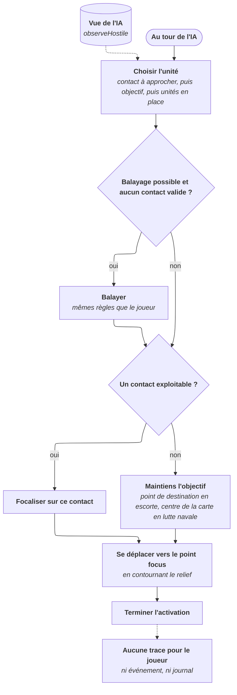

# 5. L'IA ennemie (`src/engine/ai/`)

Ce que fait l'IA pendant son tour.  
Fichiers : `objective`, `unit-selection`, `unit-movement`, `sweep`, `turn` (tous en `.ai.service.ts`).  

```mermaid
---
config:
  layout: elk
  theme: default
  look: classic
---
flowchart TB
    vue[("`**Vue de l'IA**<br>*observeHostile*`")]
    debut(["`**Au tour de l'IA**`"]) --> choix["`**Choisir l'unité**<br>*contact à approcher, puis objectif, puis unités en place*`"]
    vue -.-> choix
    choix --> balayer{"`**Balayage possible et aucun contact valide ?**`"}
    balayer -->|"oui"| balayage["`**Balayer**<br>*mêmes règles que le joueur*`"]
    balayer -->|"non"| intention
    balayage --> intention{"`**Un contact exploitable ?**`"}
    intention -->|"oui"| contact["`**Focaliser sur ce contact**`"]
    intention -->|"non"| objectif["`**Maintiens l'objectif**<br>*point de destination en escorte, centre de la carte en lutte navale*`"]
    contact --> aller
    objectif --> aller["`**Se déplacer vers le point focus**<br>*en contournant le relief*`"]
    aller --> fin["`**Terminer l'activation**`"]

    note["`**Aucune trace pour le joueur**<br>*ni événement, ni journal*`"]
    fin -.-> note
```
